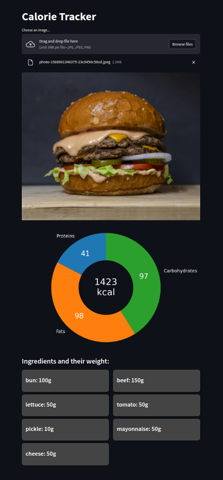

# CalorieTracker

CalorieTracker is a web application designed to help users easily track their calorie intake by leveraging advanced AI and nutritional datasets. The project integrates [VLM LLAVA](https://llava-vl.github.io) hosted on [replicate.com](https://replicate.com), a RAG (Retrieval-Augmented Generation) approach with a nutritional dataset from [Kaggle](https://www.kaggle.com/), and provides an interactive user interface built using **Streamlit**. It also employs **FastAPI** to handle asynchronous requests efficiently.

<p align="center">
  
</p>

## Features

- **AI-Powered Food Recognition**: Use VLM LLAVA to recognize food items and estimate calorie content from images.
- **RAG for Calorie Precision**: Retrieval-Augmented Generation is used to accurately determine calorie counts based on ingredient lists identified by the AI model.
- **Nutritional Dataset Integration**: Retrieve accurate nutritional information using a Kaggle dataset.
- **User-Friendly UI**: Interactive Streamlit application for seamless user experience.
- **Fast & Async API**: FastAPI ensures a smooth and responsive backend for handling requests.


## Getting Started

### Prerequisites

To set up the project locally, ensure you have the following installed:

- Python 3.9+
- [Replicate API Token](https://replicate.com/account) to access VLM LLAVA.

### Installation

1. Clone the repository:
   ```bash
   git clone https://github.com/your-username/CalorieTracker.git
   cd CalorieTracker
2. Create a .env file in the root directory and add your Replicate API Token:
    ```env
    REPLICATE_API_TOKEN=your_api_token
3. Install required dependencies:
    ```bash
    pip install -r requirements.txt
4. Run the application:
    ```bash
    make run_app
---
### Usage

* Upload an image of your meal through the Streamlit interface.
* The AI model will identify the food items in the image.
* Nutritional details, including calorie count, will be retrieved and displayed.


---
### Technologies Used
* VLM LLAVA: AI model for image-based food recognition.
* RAG: Retrieval-Augmented Generation for accessing the nutritional dataset.
* FastAPI: Backend for async API requests.
* Streamlit: Interactive user interface.
